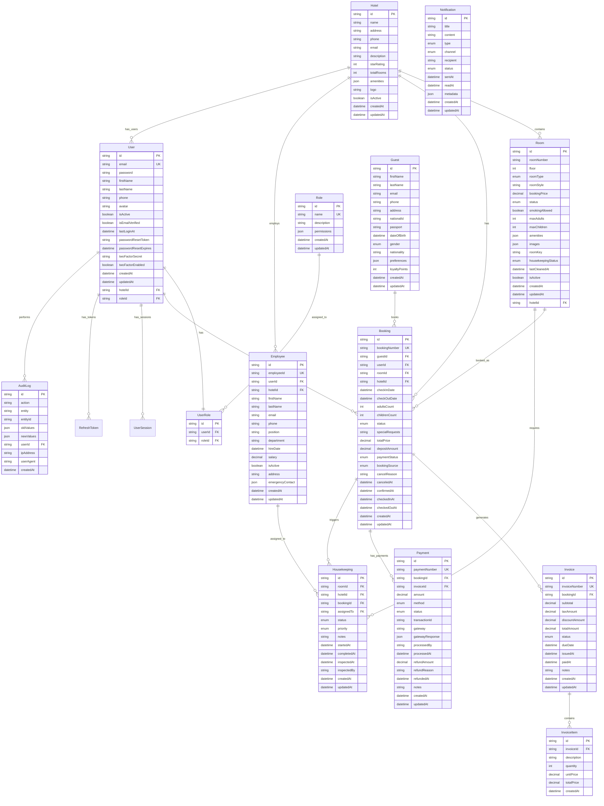

# Database Design - Nyaika Hotel Management System

## Overview

The NHMS database follows a relational model with proper normalization, foreign key constraints, and audit trails. The design supports multi-branch hotels, role-based access control, and comprehensive business operations.

## Entity Relationship Diagram (ERD)

## Database Schema Details

### Core Entities

#### Hotel
- **Purpose**: Multi-branch hotel support
- **Key Features**: Hotel configuration, amenities, branding
- **Indexes**: Primary key on `id`, unique on `name` per organization

#### User
- **Purpose**: System users with authentication
- **Key Features**: JWT authentication, 2FA support, password reset
- **Security**: Password hashing, session management, audit trails
- **Indexes**: Unique on `email`, foreign key on `hotelId`

#### Role & UserRole
- **Purpose**: Role-based access control (RBAC)
- **Key Features**: Permission-based access, hierarchical roles
- **Security**: JSON permissions field for flexible authorization

### Business Entities

#### Room
- **Purpose**: Physical room management
- **Key Features**: Room types, pricing, availability, housekeeping
- **Business Rules**: Unique room numbers per hotel, status tracking
- **Indexes**: Composite unique on `(hotelId, roomNumber)`

#### Guest
- **Purpose**: Customer information management
- **Key Features**: Personal data, booking history, loyalty points
- **Privacy**: GDPR compliance, data encryption
- **Indexes**: Email and phone for search optimization

#### Booking
- **Purpose**: Reservation management
- **Key Features**: Booking lifecycle, payment tracking, occupancy
- **Business Rules**: No double booking, availability validation
- **Indexes**: Booking number, date ranges for availability checks

#### Invoice & InvoiceItem
- **Purpose**: Financial management
- **Key Features**: Tax calculation, discounts, payment tracking
- **Business Rules**: Automatic invoice generation, audit trails
- **Indexes**: Invoice number, booking references

#### Payment
- **Purpose**: Payment processing
- **Key Features**: Multiple payment methods, gateway integration
- **Security**: Transaction logging, refund tracking
- **Indexes**: Payment number, transaction IDs

### Operational Entities

#### Housekeeping
- **Purpose**: Room maintenance tracking
- **Key Features**: Cleaning status, staff assignment, inspections
- **Workflow**: Status transitions, priority management
- **Indexes**: Room status, assigned staff

#### Employee
- **Purpose**: Staff management
- **Key Features**: Employee data, position tracking, attendance
- **Integration**: User account linkage, role assignment
- **Indexes**: Employee ID, department

#### Notification
- **Purpose**: Communication management
- **Key Features**: Multi-channel notifications, delivery tracking
- **Channels**: Email, SMS, Push, WhatsApp
- **Indexes**: Recipient, status, type

### System Entities

#### AuditLog
- **Purpose**: Comprehensive audit trail
- **Key Features**: Change tracking, user actions, compliance
- **Security**: Immutable records, forensic analysis
- **Indexes**: Entity, user, date ranges

#### UserSession & RefreshToken
- **Purpose**: Authentication management
- **Key Features**: Session tracking, token management
- **Security**: Expiration handling, revocation support
- **Indexes**: Token values, expiration dates

## Data Integrity Constraints

### Foreign Key Relationships
- All relationships maintain referential integrity
- CASCADE DELETE for dependent entities where appropriate
- RESTRICT for critical relationships to prevent accidental data loss

### Business Rule Constraints
- Room availability: Prevent overlapping bookings
- Payment validation: Ensure payment amounts match invoices
- User permissions: Enforce role-based access
- Audit completeness: Log all data modifications

### Data Validation
- Email format validation
- Phone number format validation
- Date range validation (check-in before check-out)
- Numeric range validation (prices, capacities)

## Performance Optimization

### Indexing Strategy
- Primary keys on all tables
- Unique constraints on business identifiers
- Composite indexes on frequently queried columns
- Partial indexes on active records

### Query Optimization
- Optimized for common queries:
  - Room availability searches
  - Booking history lookups
  - Financial reporting
  - Audit log searches

### Partitioning
- Consider partitioning large tables by date:
  - AuditLog (monthly partitions)
  - Booking (yearly partitions)
  - Payment (monthly partitions)

## Security Considerations

### Data Encryption
- Sensitive data encrypted at rest
- Password hashing with bcrypt/argon2
- PII encryption for guest information

### Access Control
- Row-level security for multi-tenant access
- Column-level encryption for sensitive fields
- Audit logging for all data access

### Backup Strategy
- Daily automated backups
- Point-in-time recovery capability
- Geographic redundancy for disaster recovery

## Migration Strategy

### Version Control
- Prisma migrations for schema changes
- Rollback capabilities for failed migrations
- Data migration scripts for major version upgrades

### Deployment
- Zero-downtime deployment strategy
- Blue-green deployment support
- Automated testing of migrations

## Monitoring & Maintenance

### Performance Monitoring
- Query performance tracking
- Index usage analysis
- Table size monitoring

### Data Cleanup
- Archive old audit logs
- Clean up expired sessions
- Remove soft-deleted records

### Health Checks
- Database connectivity monitoring
- Query performance alerts
- Storage capacity monitoring
