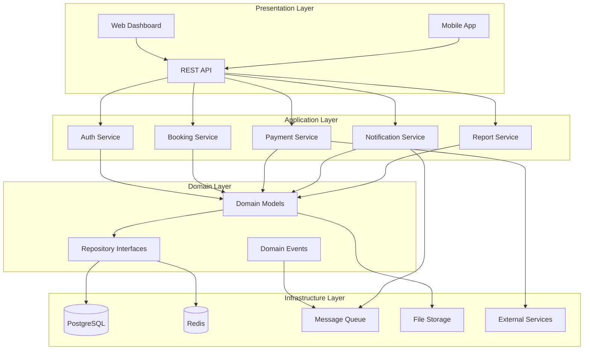
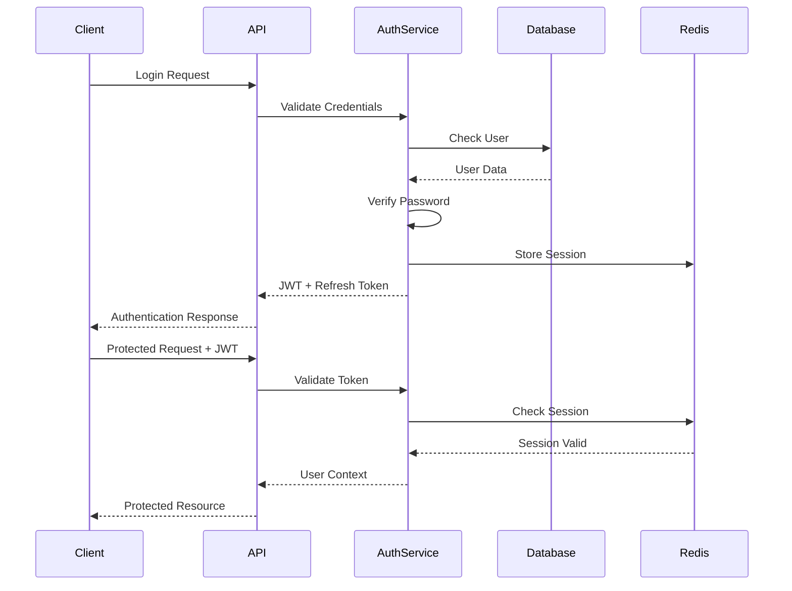
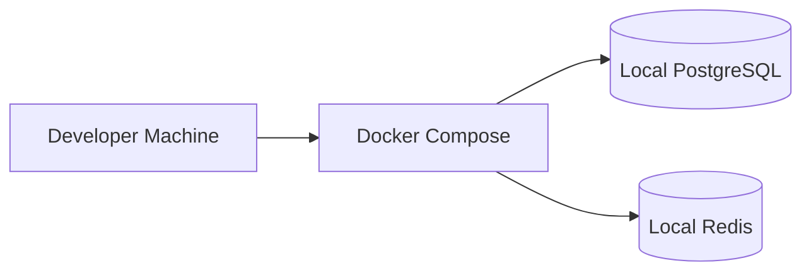
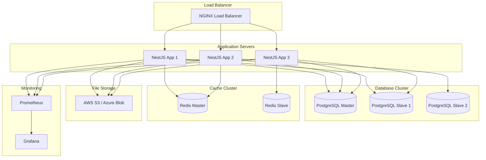

# System Architecture - Nyaika Hotel Management System

## Overview

The Nyaika Hotel Management System (NHMS) is built using **Clean Architecture** principles with a **microservice-ready modular monolith** structure. The architecture ensures scalability, maintainability, and enterprise-grade security while being deployment-ready for cloud infrastructure.

## Architectural Principles

### Clean Architecture
The system follows Robert C. Martin's Clean Architecture with distinct layers:

1. **Domain Layer** (Entities & Business Rules)
2. **Application Layer** (Use Cases & Business Logic)
3. **Infrastructure Layer** (External Dependencies)
4. **Presentation Layer** (API Controllers & UI)

### SOLID Principles
- **Single Responsibility**: Each class has one reason to change
- **Open/Closed**: Open for extension, closed for modification
- **Liskov Substitution**: Subtypes must be substitutable for base types
- **Interface Segregation**: Clients shouldn't depend on unused interfaces
- **Dependency Inversion**: Depend on abstractions, not concretions

### Domain-Driven Design (DDD)
- Bounded contexts for different business domains
- Ubiquitous language shared across teams
- Domain models encapsulating business logic

## High-Level Architecture



## Module Structure

### Core Modules

#### Authentication & Authorization
```typescript
src/modules/auth/
├── controllers/
│   ├── auth.controller.ts
│   └── roles.controller.ts
├── services/
│   ├── auth.service.ts
│   ├── token.service.ts
│   └── two-factor.service.ts
├── strategies/
│   ├── jwt.strategy.ts
│   └── local.strategy.ts
├── guards/
│   ├── auth.guard.ts
│   └── roles.guard.ts
├── decorators/
│   ├── public.decorator.ts
│   └── roles.decorator.ts
└── dto/
    ├── login.dto.ts
    ├── register.dto.ts
    └── reset-password.dto.ts
```

#### Hotel Management
```typescript
src/modules/hotel/
├── controllers/
│   └── hotel.controller.ts
├── services/
│   ├── hotel.service.ts
│   └── hotel-settings.service.ts
├── entities/
│   └── hotel.entity.ts
└── dto/
    ├── create-hotel.dto.ts
    └── update-hotel.dto.ts
```

#### Room Management
```typescript
src/modules/room/
├── controllers/
│   └── room.controller.ts
├── services/
│   ├── room.service.ts
│   ├── room-availability.service.ts
│   └── room-pricing.service.ts
├── entities/
│   └── room.entity.ts
└── dto/
    ├── create-room.dto.ts
    └── room-search.dto.ts
```

#### Booking Engine
```typescript
src/modules/booking/
├── controllers/
│   └── booking.controller.ts
├── services/
│   ├── booking.service.ts
│   ├── availability.service.ts
│   └── pricing.service.ts
├── entities/
│   └── booking.entity.ts
├── events/
│   ├── booking-created.event.ts
│   └── booking-cancelled.event.ts
└── dto/
    ├── create-booking.dto.ts
    └── booking-search.dto.ts
```

### Shared Infrastructure

#### Database Layer
```typescript
src/shared/database/
├── prisma.service.ts
├── repository.base.ts
└── migrations/
```

#### Cache Layer
```typescript
src/shared/redis/
├── redis.service.ts
├── cache.service.ts
└── session.service.ts
```

#### Message Queue
```typescript
src/shared/queue/
├── bull.config.ts
├── processors/
│   ├── notification.processor.ts
│   └── report.processor.ts
└── jobs/
    ├── email.job.ts
    └── sms.job.ts
```

## Technology Stack

### Backend Technologies

#### Core Framework
- **Node.js** - JavaScript runtime
- **NestJS** - Progressive Node.js framework
- **TypeScript** - Type-safe JavaScript

#### Database & ORM
- **PostgreSQL** - Primary database
- **Prisma ORM** - Database toolkit
- **Redis** - Caching and sessions

#### Authentication & Security
- **JWT** - Stateless authentication
- **bcrypt** - Password hashing
- **Helmet** - Security headers
- **Rate Limiting** - DDoS protection

#### Message Queue & Background Jobs
- **BullMQ** - Job queue system
- **Redis** - Queue backend

#### File Storage
- **Multer** - File uploads
- **Sharp** - Image processing
- **Cloud Storage** - AWS S3/Azure Blob

### Frontend Technologies

#### Core Framework
- **React.js** - UI library
- **Next.js** - React framework
- **TypeScript** - Type safety

#### Styling & UI
- **TailwindCSS** - Utility-first CSS
- **Headless UI** - Unstyled components
- **Lucide React** - Icon library

#### State Management
- **Zustand** - Lightweight state management
- **React Query** - Server state management

#### Forms & Validation
- **React Hook Form** - Form management
- **Zod** - Schema validation

### Infrastructure Technologies

#### Containerization
- **Docker** - Container platform
- **Docker Compose** - Multi-container apps

#### Reverse Proxy
- **NGINX** - Web server & reverse proxy

#### Monitoring & Logging
- **Winston** - Structured logging
- **Prometheus** - Metrics collection
- **Grafana** - Visualization dashboard

#### CI/CD
- **GitHub Actions** - Continuous integration
- **Docker Registry** - Container storage

## Security Architecture

### Authentication Flow


### Authorization Model
- **Role-Based Access Control (RBAC)**
- **Permission-based fine-grained access**
- **Multi-tenant isolation**
- **API endpoint protection**
- **Resource-level permissions**

### Data Protection
- **Encryption at rest** (AES-256)
- **Encryption in transit** (TLS 1.3)
- **PII data masking**
- **Audit logging**
- **GDPR compliance**

## Scalability Architecture

### Horizontal Scaling
- **Stateless application servers**
- **Load balancer distribution**
- **Database read replicas**
- **Redis clustering**
- **Microservice decomposition ready**

### Performance Optimization
- **Database indexing strategy**
- **Query optimization**
- **Caching layers**
- **CDN integration**
- **Image optimization**

### High Availability
- **Multi-zone deployment**
- **Database failover**
- **Redis clustering**
- **Health checks**
- **Graceful degradation**

## Deployment Architecture

### Development Environment


### Production Environment


## Integration Architecture

### External Service Integrations
- **Payment Gateways**: Stripe, PayPal, Flutterwave
- **Email Services**: SendGrid, AWS SES
- **SMS Services**: Twilio, Africa's Talking
- **Channel Managers**: SiteMinder, Booking.com
- **Accounting Software**: QuickBooks, Xero

### API Gateway Pattern
```typescript
// API Gateway Configuration
const gatewayConfig = {
  routes: [
    {
      path: '/api/v1/auth/*',
      service: 'auth-service',
      rateLimit: { requests: 10, window: '1m' }
    },
    {
      path: '/api/v1/booking/*',
      service: 'booking-service',
      rateLimit: { requests: 100, window: '1m' }
    }
  ]
};
```

### Event-Driven Architecture
```typescript
// Domain Events
interface DomainEvent {
  id: string;
  type: string;
  data: any;
  timestamp: Date;
  version: number;
}

// Event Handlers
class BookingEventHandler {
  @OnEvent('booking.created')
  async handleBookingCreated(event: BookingCreatedEvent) {
    await this.notificationService.sendBookingConfirmation(event.data);
    await this.housekeepingService.scheduleCleaning(event.data);
  }
}
```

## Monitoring & Observability

### Logging Strategy
- **Structured logging** with Winston
- **Log levels**: Error, Warn, Info, Debug
- **Correlation IDs** for request tracing
- **Log aggregation** with ELK stack

### Metrics Collection
- **Application metrics**: Response time, error rate
- **Business metrics**: Bookings, revenue, occupancy
- **Infrastructure metrics**: CPU, memory, disk
- **Custom metrics**: KPI tracking

### Health Monitoring
- **Health check endpoints**
- **Database connectivity**
- **External service availability**
- **Queue status monitoring**

## Development Workflow

### Code Organization
```
src/
├── modules/           # Business modules
├── shared/           # Shared utilities
├── config/           # Configuration
├── common/           # Common decorators/guards
└── database/         # Database setup
```

### Testing Strategy
- **Unit tests**: Jest + Supertest
- **Integration tests**: Database testing
- **E2E tests**: Cypress
- **Performance tests**: Artillery

### Quality Assurance
- **ESLint** + **Prettier** for code formatting
- **Husky** for git hooks
- **SonarQube** for code quality
- **Security scanning** with Snyk

## Future Architecture Evolution

### Microservice Migration Path
1. **Extract bounded contexts** into services
2. **Implement API gateway** for routing
3. **Service discovery** with Consul
4. **Distributed tracing** with Jaeger
5. **Circuit breakers** with Hystrix

### Cloud-Native Features
- **Kubernetes** orchestration
- **Service mesh** with Istio
- **Serverless functions** for specific tasks
- **Multi-cloud deployment** support

This architecture provides a solid foundation for a production-ready hotel management system that can scale from a single hotel to a multi-chain operation while maintaining security, performance, and reliability.
